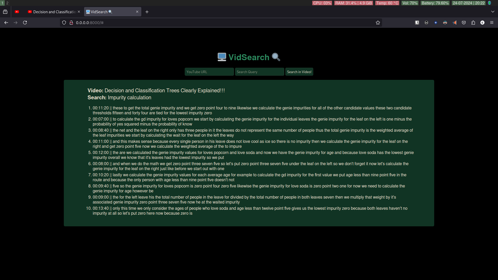

# VidSearch
**Text-based Search for Relevant Scenes in Videos**  
Searching for some specific information in long YouTube tutorials?  
VidSearch is an ML tool transcribing YouTube videos and searching for relevant parts based on the search query and its meaning.

## Screenshots
